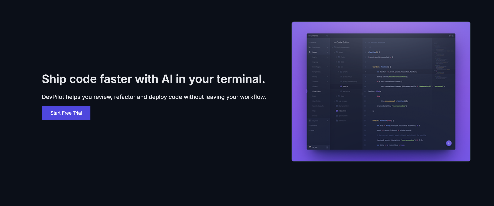
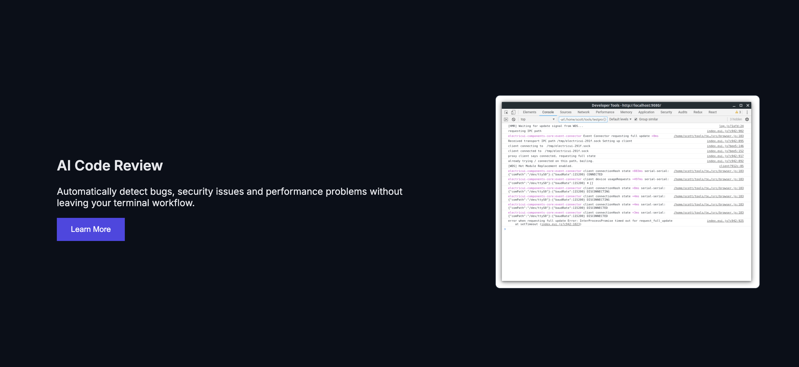

# Developer Tool Landing Page (Cursor Inspired)

This project is a desktop-only landing page for a fictional developer productivity tool called **DevPilot**.
The design is inspired by the Cursor developer tool landing page UI.

---

## 📌 Sections Recreated

The following sections were recreated using only HTML and CSS:

- Top Navigation Bar  
- Hero Section  
- Trusted By (Logo Section)  
- Feature Section  
- Feature Cards Section  
- Testimonial Section  
- Use Case Section  
- Changelog / Updates  
- Team Section  
- Final Call To Action  
- Footer  

---

## 🎨 Fonts Used

Google Font:

- Inter

Imported using:

<link href="https://fonts.googleapis.com/css2?family=Inter:wght@300;400;500;600&display=swap" rel="stylesheet">

---

## 🎨 Color Palette Used

| Purpose | Color Code |
|--------|-------------|
Background | #0B0F19 |
Card Background | #111827 |
Border | #1F2937 |
Primary Text | #E5E7EB |
Secondary Text | #9CA3AF |
CTA Button | #4F46E5 |

---

## 🛠️ Tech Stack

- HTML5  
- CSS3  

Constraints followed:

- No JavaScript used  
- No TailwindCSS  
- Desktop-only layout  
- No animations  
- No frameworks  

---

## 📸 Screenshots

### Hero Section

### Feature Section

---

## 🌐 Live Website

https://github.com/BEASTXCHAITANYA/devpilot-landing-page.git

---

## 📂 GitHub Repository

https://github.com/BEASTXCHAITANYA/devpilot-landing-page.git

---

## 🚀 How to Run Locally

1. Clone the repository
2. Open project folder
3. Run index.html in browser

---

## 📎 Note

This project was created for academic assignment purposes and is inspired by the UI design principles of developer-first SaaS landing pages.